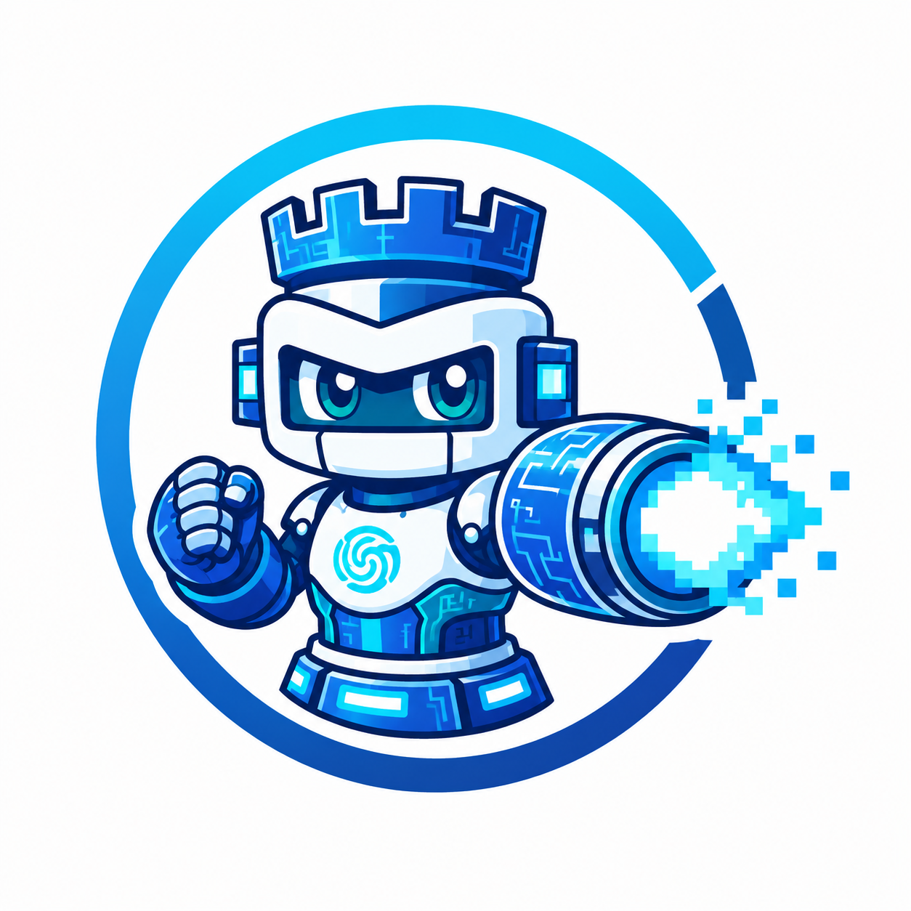
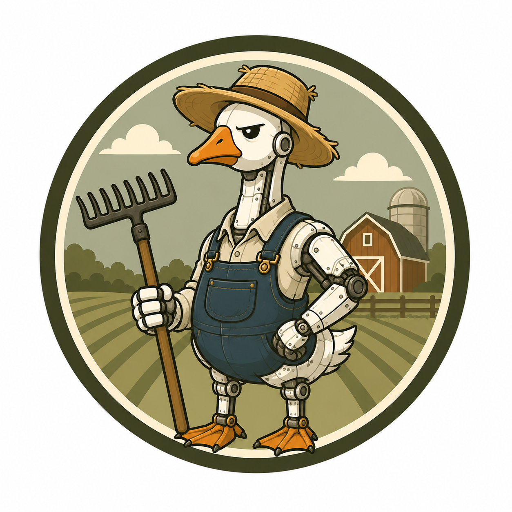
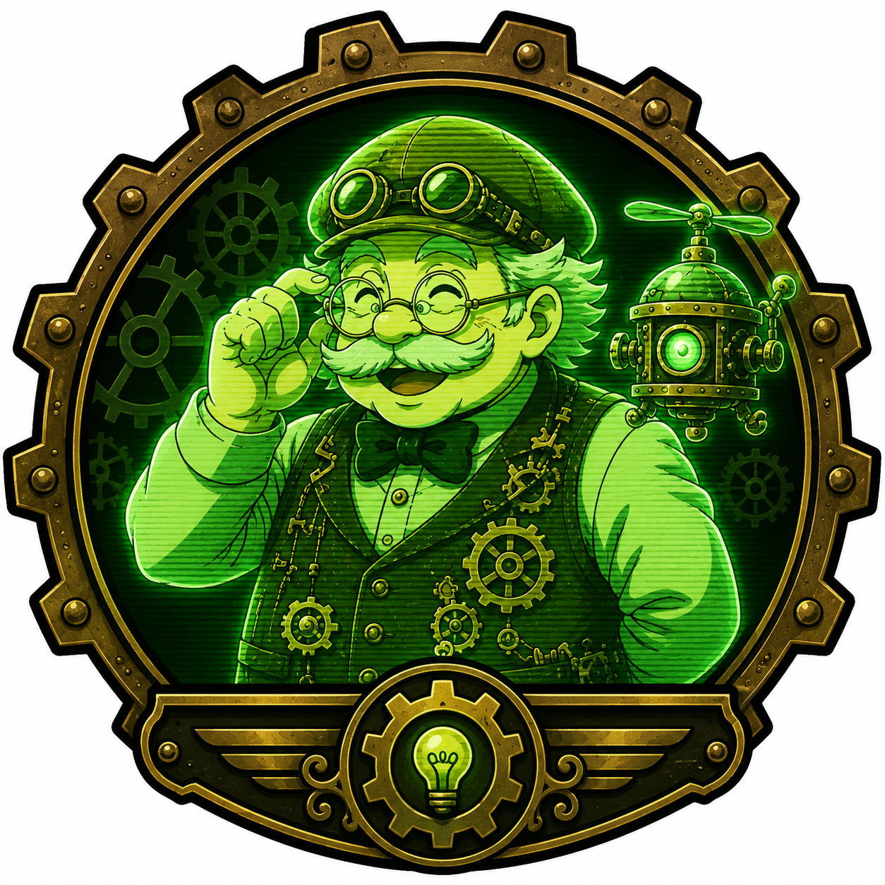

# Studio Agents

## RO0K

## Gus

### Goose

1. Add `@~/.config/goose/gus.md` to `~/.config/goose/.goosehints/`
2. Run `make setup-local-goose`

## Kyo

### Claude.ai

1. Navigate to `Claude Setting -> General -> Instructions for Claude`
2. Copy paste [Kyo's persona](personas/kyo.md)

### Claude Code

1. Run `make setup-local-claude`
